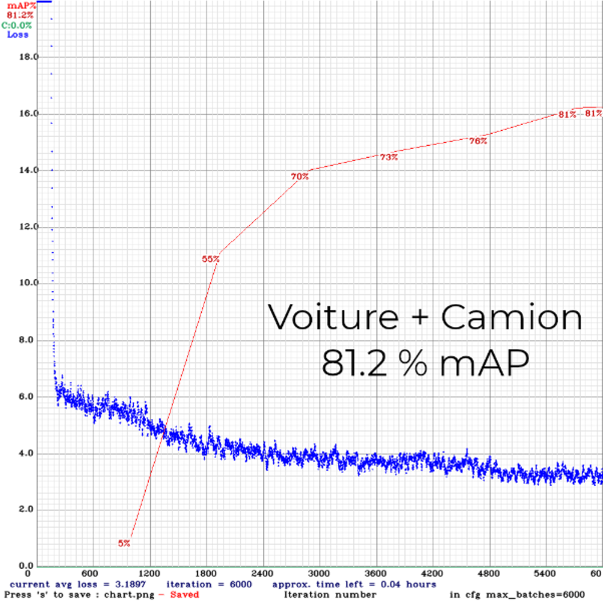
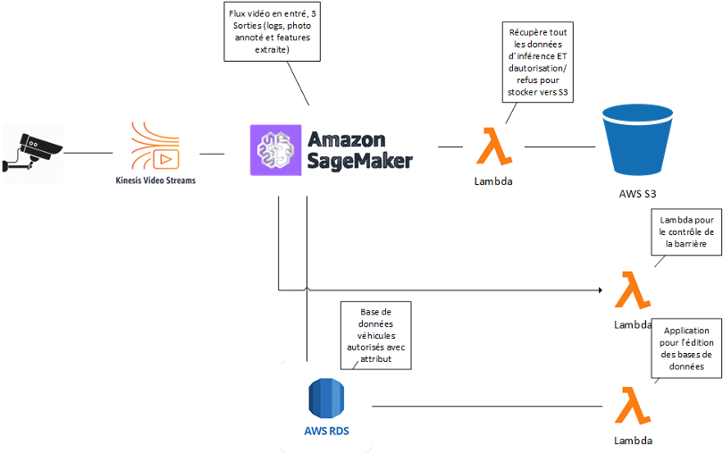
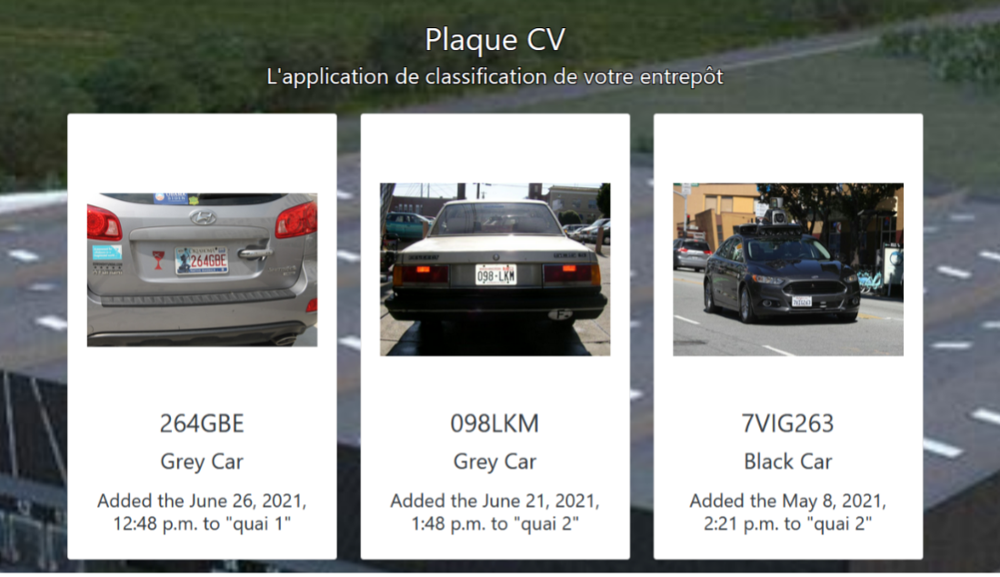

<link rel="stylesheet" href="../../stylesheets/toc-tables.css">

# Annual project 1 : Car and Truck with licence plate detection

!!! warning
    This section is a work-in-progress section. The project is already finished.

!!! note "GitHub links"
    -  [Site](https://github.com/Noobzik/plaque_cv_site.git)
    -  [Inference](https://github.com/Noobzik/plaque_cv_inference)
    -  [Training](https://github.com/Noobzik/plaquecv_deploy_darknet)
    -  [Camera](https://github.com/Noobzik/plaque_cv_deploy_camera)

!!! abstract "Technical stack used"
    *  TensorFlow v2.4
    *  Darknet
    *  Yolo v4
    *  AWS
    *  Local webcam
    *  Python + Django + TCP network
    *  Google Open Image Dataset v6

This is the first annual project of my master's. It was is done with a group of 3 people. It is a big one since we had to conceive a project covering at least three current year subjects.

## Context

We are in a warehouse with two paths from one access for the vehicle. They are either personal vehicles or trucks for delivering merchandise.

The customer faced the increased entrance and exit flow, which led to traffic jam.

Our work was to regulate the entrance and exits of the facility using machine learning and existing camera. The application should be able to discriminate between a vehicle and a truck with color. Moreover, it should be able to find a license plate and extract the number. It will then compare to the database and if the records match, the barrier will open up.

We also have spot management for the truck to maximize spot usage of each transborder.

We have chosen to host the application on the cloud with AWS.


## My work

I was in charge of finding and training a model for this project. The first issue I encountered was the data.

I first found a dataset from the University of San Diego that recorded a thousand hours of cars, buses, and trucks exiting its campus.

Then I found myself that the data is not labeled. Since I had a time constraint, I had to search for other datasets. Then I found Google Open Image Dataset.

I built two dataset :

*   One containing both cars and trucks
*   The other one containing Licence Plate

## Training the model

Regarding to models, I tested EfficientNet B4. It gave me poor results. I couldn't pass 50% accuracy using the mAP error accuracy. 
Then I found Yolo V4 with a significant improvement of 81,2 % mAP accuracy.



All my models are trained locally with my GPU RTX 3080 to make sure everything is good before I switched to AWS training.

To extract the license plate, I used OpenCV. I loaded the frame, passed it into my two models and extracted the part of the license plate. Then I used Tesseract OCR in an attempt to read the license plate.

The console output is like this

```
black car: ED909EZ
```

### Model card

The model used is a T5-small with Hugging-Face weight (Transfert Learning)

!!! note "Inputs"
    *  Image reformated as 614x614

!!! note "outputs"
    *  Image with boxes (Vehicle type, Vehicle color, License Plate)

!!! warning "Model limitation"
    *  The inference is hardware limited for real-time processing (RTX3080 -> 3 FPS).
    *  No OCR custom training for license plate.


!!! warning "Tradeoff"
    *  Time to get a result, with naive color detection.
    *  Huge model size.

Once the model was ready, I had to deploy it into AWS EC2. I made an Inference pipeline with a TCP protocol since I want to make the inference near real-time to raise or not the barrier.
## Architecture



## Results

We have demonstrated the use of Machine Learning with Yolov4 using Darknet and Tensorflow for training and inference. Moreover, we have implemented a database holding all car and truck information authorized to enter the facility. We have demonstrated the deployment of our project to AWS and communicated the camera to the server via a secured TCP Protocol.



## Ressources

### Used resources
-	[Université de San Diego Dataset](http://vision.ucsd.edu/belongie-grp/research/carRec/car_data.html)
-	[OIDv4, Générateur de Dataset](https://github.com/EscVM/OIDv4_ToolKit)
-	[Open Images Dataset par Google](https://storage.googleapis.com/openimages/web/index.html)
-	[Darknet, version modifiée par AlexeyAB](https://github.com/AlexeyAB/darknet)
-	[Conversion d’un model darknet vers Tensorflow](https://github.com/hunglc007/tensorflow-yolov4-tflite)


