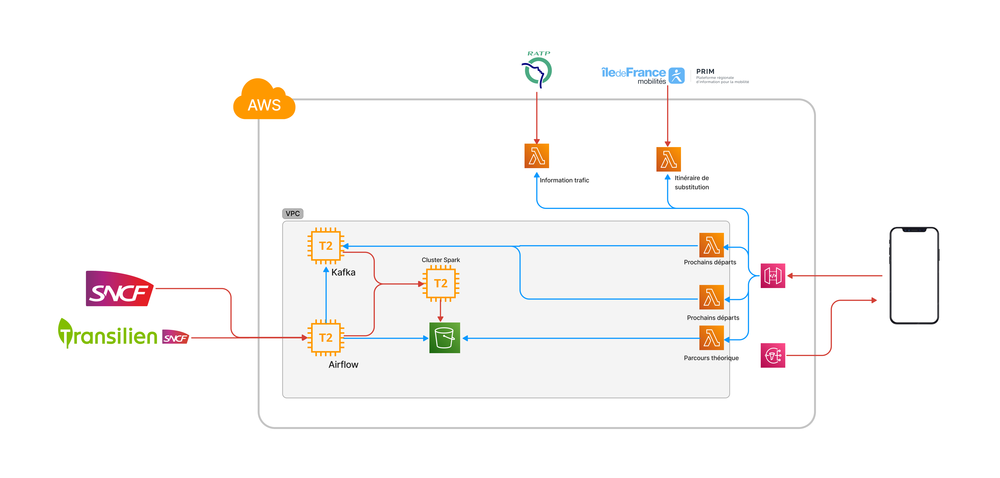
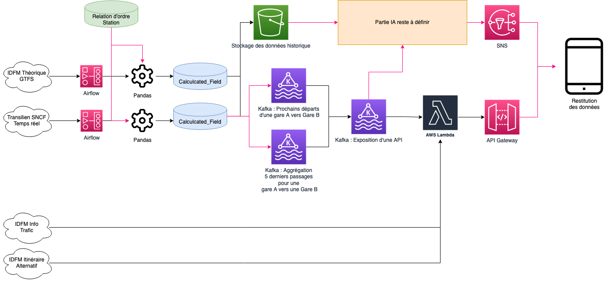

<link rel="stylesheet" href="../../stylesheets/toc-tables.css">

# Annual project 2 : RE-GONE RER B

!!! warning
    This section is incomplete. I am still working on this project for my personal use.

This is the last annual project of my master. The project was made with a group of 3 people. This is a big one since we had to conceive a project that cover at least three subject of the current year.

!!! note
    [Github Project](https://github.com/Noobzik/regone)

!!! abstract "Technical Stack used"
    *  Apache Kafka
    *  Apache Spark
    *  Scala
    *  Python
    *  Airflow
    *  Docker
    *  Terraform
    *  CookieCutter

## Context

Everyday, more than 9,4M Parisians are commuting with the RER B. Since 2012, the services is severly degraded even though it has known endless work. Most services disruptions are caused by train failure, signalisation failure, suicide, lost luggages, fights.

Daily, travelers are confronted with the traffic disruptions that can cause a delay of fewer than 15 minutes or more than 3 hours based on the situation.

Disruptions in the transportation plan can affect different types of travelers:

-  Classroom and exam rooms access may be denied to the students .
-  People who are salaried/employed whose paychecks may be cut from their paychecks.
-  People who are in transit to and from airports.
-  Sick peoples and missing medical appointments at a medical center.

The RER B is the second busiest line of the network at 983,000 passengers everyday in 2019. It is co-operated by RATP and Transilien SNCF.
RATP operates between Saint-Rémy-Lès-Chevreuse / Robinson / Châtelet, and SNCF operates between Aéroport Charles-de-Gaulle / Mitry-Claye / Gare-du-Nord.

To measure the quality of the transport plan, Ile-de-France Mobilités uses a punctuality indicator. It is reported to the public annually, with monthly and yearly results. The RER B has a punctuality of 86.9% in 2021, which makes it the most disrupted line of all the RER and Transilien lines. The target assigned is 89%, which is a deviation of -2.1% from the target. 

When Line B traffic is disrupted, it is usually already too late for the traveler to take the necessary precautions to arrive on time and minimize the time delay. It takes an average of 40 minutes after the start of the incident before it is broadcasted widely to the passenger.

This project covers the RER B line, between Gare-du-Nord and Aéroport Charles-de-Gaulle / Mitry-Claye (The SNCF Part)

## Objective

To reduce the time required to broadcast it, we will use open data to monitor the time a train travels between two stations. We will use the moving average. When there is a significant change, we shall broadcast that the traffic might be disrupted and advise them to plan alternate routes.

We want to bring another vision on traffic information. Using the open data of Transilien SNCF, RATP, and Ile-de-France mobilités, we seek to restore the information:

-  The list of the next departures from a station.
-  Theoretical travel time.
-  Suggest an alternative route that bypasses the entire line B.
-  Official traffic information from RATP/SNCF
-  That traffic is likely to be disrupted. 
-  On the actual travel time.

This information will be provided through a mobile application for the end user.
The objective is to demonstrate the skills of the following subjects taught at ESGI this year

-  Stream processing with Kafka
-  Docker & Kubernetes
-  AWS for ML and Big Data (Airflow mainly)
-  Automation of Data Infrastructure

## Data Lineage

## My work

I was handling Data Engineering, Model building and AWS architectural provisioning.

1.  Gathering API Endpoints to build the dataset
2.  Grab data and clean, save it to S3
3.  Build a pipeline to offer endpoints for end-users
4.  Docker conteurisation
5.  Train a model

