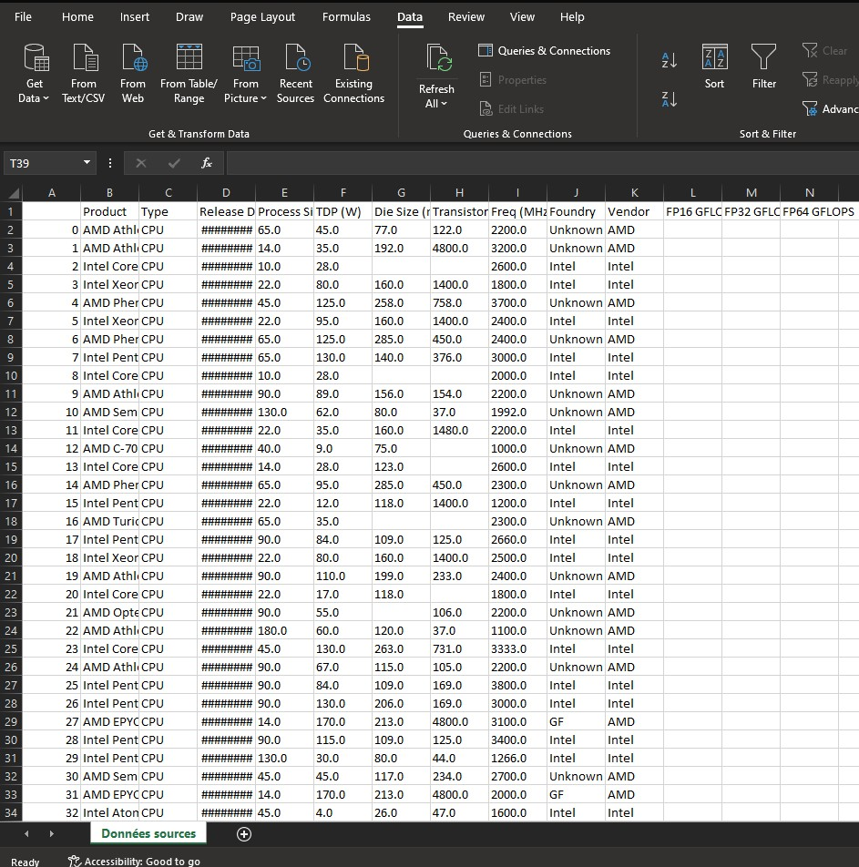

# TP Excel Niveau avancé.

!!! warning
    TP incomplet, en cours de rédaction
    
Vous avez déjà réalisé un TP d'introduction lors de la première semaine. Comme tout le monde n'étaient pas présent, je vous propose qu'on reparte de 0 mais avec des données volumineuse et en lien avec la formation.

Ce TP dirigé à pour but de vous familiariser avec Microsoft Excel et Google Sheet. C'est un outil important qui va vous permettre de réaliser un suivi de comptabilité, faire une analyse de donnée, ou tout simplement réaliser des calcules successifs. Accrochez-vous bien, car ce n'est pas plaisant. 

Ce TP reste malgré tout guidé, mais plus vous avancerez dans votre travail, moins vous serez guidé. Je vous met à l'épreuve sur la recherche des solutions sur internet et auprès de vos camarades. N'hésitez pas à les solliciter si vous bloquez sur un point.

!!! note "Le résultat final"
    Un tableau de bord fonctionnel permettant une analyse de données, à l'aide des formules et des tableaux croisées dynamiques.

!!! warning "Attention"
    Pensez à sauvegarder votre fichier très régulièrement ! Le moindre plantage d'Excel peut vous faire perdre votre avancée de travail. Pour cela, utilisez le raccourci clavier ++ctrl+s++ au lieu de faire `Ficher` -> `Enrengistrer`

## Repartons sur de bonnes bases : Les définitions.

Armez vous de patience, il y aura beaucoup de lecture.

Excel et Google Sheets sont des outils qui permettent principalement à réaliser des calcules à la fois basique et complexe. Les cas d'utilisations que l'ont peut citer sont les suivants (non exhaustive):

-   Création de tableau de bord pour assurer un suivit des indicateurs.
-   Monter un dossier de budget.
-   Réaliser un listing des personnes avec des informations personnels.
-   Création des formulaires.
-   Edition des factures
-   Relevés de notes.
-   Fiche de paies.

Cette outil est formellement appelé un tableur. Une définition précise d'un tableur est le suivant: Un tableau permet de construire et de visualiser des tableau, contenant des données et des formules de calcules.

En règle générale, à chaque fois que l'on à faire un tableau avec des calcules, on pensera à utiliser un tableur.

!!! note "Action à faire"
    Ouvrez l'application Excel. Nous allons prendre en main l'utilisation d'Excel.

Premièrement, on peut remarquer la présence d'un ensemble de rectangle en plein milieu de l'application. On les appelles les Cellules. Vous avez donc compris par déduction que l'on appelle une Cellule pour un seul rectangle.

Lorsque l'on sélectionne un ensemble de cellule, on parlera alors d'une plage de cellules.

En bas de l'application, vous avez un onglet qui s'appelle sûrement Feuille 1.

## Le fichier de base à télécharger ##

[Voici le lien vers le fichier source à télécharger](https://www.kaggle.com/datasets/michaelbryantds/cpu-and-gpu-product-data?select=chip_dataset.csv)

## Partie 0: Préparation du fichier

### Le fichier source

Vous avez du remarquer que le fichier que vous venez de télécharger n'est pas sous la forme d'un ficher de tableau classique que l'on connait (XLS ou ODS). En effet, vous avez un fichier CSV (Comma Separated Values, pour "Séparation des valeurs par virgule"). 

Pour votre culture personnel, un ficher CSV, lorsque vous l'ouvrez dans un éditeur de texte, vous allez visualiser des données sans mise en formes, qui sont séparés par des virgules. Chaque séparation de virgule correspond à une colonne. En générale, la première ligne de colonne correspond aux titre des colonnes.

!!! abstract "Actions"
    * Ouvrez un nouveau fichier Excel.
    * Ouvrez le fichier que vous avez téléchargé.
    * Copiez-Collez les données vers votre fichier excel.
    * (Nouveau) Renommez la feuille de votre fichier Excel avec le nom suivant : `données sources`.
    * Supprimez les données `NaT` dans la colonne des dates.
    * Sauvegardez le fichier dans un format XLSX.

!!! warning "Remarque"
    Si jamais lorsque vous ouvrez le fichier CSV et que vous avez l'affichage suivant :
    
    Vous devez nettoyer le texte avec le bouton `Convertir` qui se trouve dans l'onglet `Données`. A vous de chercher comment le faire.

??? note "Résultat attendu"
    

## Partie 1 : Création d'un tableau croisée dynamique

*   Maintenant vous allez devoir chercher comment créer un tableau croisée dynamique.
*   Le nom de la feuille sera `TCD`

??? note "Résultat attendu"
    

## Partie 2 : Ajout des colonnes.

Maintenant que nous avons créée un tableau croisée dynamique, on doit le remplir de valeurs afin de réaliser nos premiers analyse. Tout les calcules de regroupement seront des moyennes.

Commencez tout d'abord par mettre en ligne le produit.

Vous remarquerez que Excel va automatiquement mettre la liste des produits de manière automatique.

Maintenant il faut qu'on ajoute les colonnes. Nous allons afficher les colonnes suivantes :

- TDP
- Process Size
- Die Size
- Transistor
- Freq
- FP16 GFLOPS
- FP32 GFLOPS
- FP64 GFLOPS

??? note "Résultat attendu"
    

## Partie 2 : Création des filtres simples

Vous devez créer plusieurs filtres sur les items suivants:

- Constructeur
- Type de composant

Vous devrez également grouper les produits par années.

??? note "Résultat attendu"
    

## Partie 3 : Création des graphiques

Maintenant, nous pouvons déjà commencer à avoir quelque graphiques pour débuter notre analyse.

Vous allez créer les graphiques suivants, dans une feuille de calcule 

## Pause ludique 

!!! warning "Assez d'Excel ! Faisons une pause ludique"
     Avant de continuer vers la partie 4 (et de mieux appréhender les fonctions imbriqués d'Excel) vous devez suivre le cours d'introduction à l'algorithmique.

Vous devez installer le jeu Rabbit's Coding! soit sur votre PC Personnel à travers d'Ubisoft, soit sur votre smartphone.

## Partie 4 : Création des valeurs intermédiaires et des KPI

Avant de continuer dans cette section, une introduction à l'utilisation des formules s'impose.

Vous avez vu jusqu'à présent l'utilisations des outils simples et guidés pour réaliser vos premières analyses. Cependant, il arrive que vous avez besoin des calcules légèrement complexes pour affiner votre analyse.

On utilisera donc des formules. Ce sont des bout de code qui permet de réaliser un calcul personnalisé.

Nous allons voir quelque fonctions de bases les plus utilisés.

### Fonctions de base 

!!! note "`=` (Signe égale)"
     Toute fonction commence par le signe `=`. Cela permet d'informer Excel que la cellule qui va être lue est un calcul à réaliser

!!! note "SOMME, SOUSTRACTION, PRODUIT, DIVISION"
     Ces quatres fonctions vous sont familiers. En effet, on les utilise au quotidien pour calculer le budget que l'on dispose, le coût d'une certaine quantité d'article, les réductions à appliquer voire même le partage d'une facture d'un restaurant au sein d'un groupe d'ami.
!!! note "SI"
     Nous sommes amenées à réaliser un choix en fonctions des calcules que l'on souhaite réaliser. La fonction SI permet de tester un résultat d'un calcule. En fonction du résultat, il en découle deux choix possible. VRAI ou FAUX.
!!! note "ET et OU"
     Il est possible de combiner nos calcules. *   Pour la fonction ET, on s'assure que deux conditions soit Vrai.
     * .  Pour la fonction OU, il suffit que l'une des deux conditions soit Vrai pour que ça soit vrai.
     Nous y revenons plus en détails lors des cours de l'Algèbre Linéaire à travers l'Introduction au Structures mathématiques.
!!! note "Les $ dans les formules"
     Il y aura des moments où on doit recopier des formules rapidement, sauf que l'on souhaite garder les mêmes références de plage de cellules. On utilise alors le `$` pour garder la même référence de la plage lors des copies rapide de formules.

!!! note "RECHERCHEV et RECHERCHEH"

## Partie 5 : Mise en forme automatique d'un tableau

!!! note "Le résultat final"

## Partie 5 : Filtrage personnalisé

Je vais vous montrer comment on réalise un bouton personnalisé sous la forme d'une liste déroulante. Celle-ci est particulièrement utile lorsque vous avez besoin de garder le tableau croisée dynamique intacte.

Vous utiliserez la fonction RECHERCHEV ou REHCERCHEH afin d'afficher vos valeurs en fonction du filtre que vous avez définit.

## Partie 6 : Création d'une page de synthèse

Maintenant, vous avez tout les outils pouvoir réaliser la page de synthèse. Je vous demande donc d'afficher le nom du tableau de bord, un bouton sous la forme d'une liste déroulante. Tout les KPI's.

## Partie 7 : Mise sous forme d'un tableau de bord.

Vous avez votre page de synthèse, bravo. Mais votre page de graphique reste à retravailler afin d'avoir l'impression qu'on regarde un tableau de bord et non un simple fichier EXCEL. Vous devez donner un titre général en haut de la page, et faire en sorte que vos graphiques s'affiche sans faire un défilement horizontale.

## Partie 8 : Définition d'une plage d'impression

Maintenant que votre tableau de bord est prêt, votre direction a besoin d'imprimer les magnifiques graphiques que vous avez réalisés. Mais il y a un problème, tout ne rentre pas sur une feuille A3.

Pour cela il faut définir une zone d'impression. En revanche, par des soucis d'écologique, je vous interdit formellement d'imprimer le tableau de bord. Si vous devez réaliser des tests, je vous laisse le soin de chercher comment imprimer une feuille de calcule EXCEL en PDF.

## Partie 8 : Rendu final

Vous allez rendre le fichier final sur Moodle (ou bien teams si l'administration ne m'a toujours pas filé mes accès)