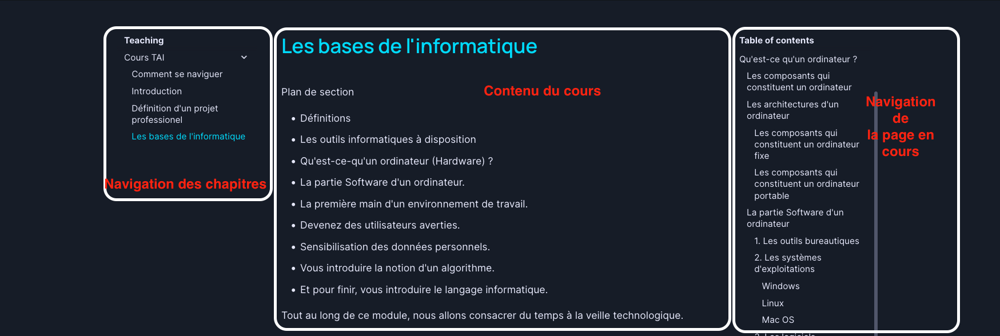

# Tutoriel navigation

Le site du cours est divisé en trois sections :

1.  La première section qui se trouve à gauche, corresponds à la listes des modules.

2.  La deuxième section qui se trouve au centre, correspond au contenu du module actuellement sélectionné.

3.  Et pour terminer, la troisième section, elle correspond à la navigation du module sélectionné.

